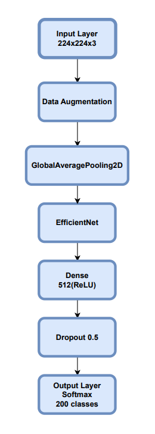

# Classificador de Imagens com TensorFlow/Keras

## Objetivo

O projeto utiliza o **dataset CUB-200-2011**, um conjunto de dados utilizado na área de Visão Computacional, contendo **200 espécies de aves** com cerca de 11.788 imagens anotadas.
O objetivo principal é construir um classificador que seja capaz de identificar corretamente a espécie da ave a partir de uma imagem.


Este relatório descreve a implementação de um pipeline de **classificação de imagens** utilizando **Transfer Learning com EfficientNetV2B1**, com suporte a congelamento de camadas, fine-tuning, e visualização do histórico de treinamento.
O código está estruturado na classe `Classifier`.

---

## Estrutura Geral

O script está dividido em três partes principais:

- Carregamento e preparação dos dados
- Construção e treinamento do modelo
- Avaliação e visualização dos resultados

---

## 1. Carregamento e Preparação dos Dados

O dataset **CUB-200-2011** está organizado em subpastas para cada classe (espécie de ave), separadas nos diretórios `train` e `test`. O carregamento é feito utilizando a função `image_dataset_from_directory`, que converte as imagens em tensores do TensorFlow para treinamento e validação.


A função `_load_datasets()` realiza a leitura das imagens do diretório:

```python
self.train_ds = image_dataset_from_directory(
    self.data_dir / "train",
    image_size=self.img_size,
    batch_size=self.batch_size,
)
```

### Melhorias de performance:
- `.cache()`: evita reprocessamento dos dados.
- `.shuffle(1000)`: embaralhamento para generalização.
- `.prefetch(buffer_size=AUTOTUNE)`: leitura assíncrona.

---

## 2. Construção do Modelo

O modelo utiliza a arquitetura `EfficientNetV2B1`, pré-treinada com pesos do ImageNet:

```python
conv_base = keras.applications.EfficientNetV2B1(
    weights="imagenet", include_top=False, input_shape=(224, 224, 3)
)
```

### Etapas:
- **Camadas de aumento de dados (data augmentation)**: `RandomFlip`, `RandomRotation`, etc.
- **Extração de características** com `GlobalAveragePooling2D`.
- **Camada densa + Dropout**: para adaptação ao novo domínio.
- **Saída**: `Dense(self.num_classes, activation="softmax")`.

---
## Estrutura do Modelo

O classificador utiliza a arquitetura EfficientNetV2B1 com camadas adicionais para adaptação ao dataset CUB-200-2011. Abaixo está o diagrama com os principais blocos do modelo:



---

## 3. Treinamento

### Fase 1: Pré-treinamento
- Camadas da `EfficientNetV2B1` estão congeladas (`trainable = False`).
- Otimizador: `Adam`, `lr=1e-4`.

### Fase 2: Fine-tuning
- Camadas da EfficientNet são descongeladas.
- Otimizador: `Adam`, `lr=1e-5`.

```python
conv_base = self.model.get_layer(index=3)
conv_base.trainable = True
```

### Callbacks:
- `ModelCheckpoint`: salva o melhor modelo.
- `EarlyStopping`: evita overfitting monitorando `val_loss`.

---

## 4. Avaliação do Modelo

A função `evaluate()` carrega o modelo salvo e calcula a acurácia no conjunto de validação:

```python
self.model = keras.models.load_model(self.model_path)
test_loss, test_acc = self.model.evaluate(self.val_ds)
```

---

## 5. Visualização dos Resultados

A função `plot_history()` gera gráficos comparativos de:

- **Acurácia de treino vs. validação**
- **Loss de treino vs. validação**

Com destaque para:
- Melhor acurácia de validação (com anotação)
- Menor valor de `val_loss` (com anotação)

```python
plt.savefig(save_path, dpi=300)
```

---

## 6. Execução Principal

A função `train_model(train=True)` dispara o pipeline completo:

```python
if __name__ == "__main__":
    train_model(train=EnvVars.TRAIN)
```

Verifica variável de ambiente `TRAIN` e executa:

- Treinamento
- Avaliação
- Geração dos gráficos

---

## Recursos Utilizados

- **TensorFlow**: base para todo o pipeline
- **EfficientNetV2B1**: modelo eficiente e moderno
- **Keras Callbacks**: `ModelCheckpoint`, `EarlyStopping`
- **Matplotlib**: visualização de métricas
- **ImageDatasetFromDirectory**: carregamento eficiente de imagens
- **Estrutura modular (classes e métodos)**: favorece reuso e manutenção

---

## Considerações Finais

Este pipeline oferece uma solução eficiente e extensível para problemas de classificação de imagens com alto desempenho, utilizando **transfer learning** e estratégias de **fine-tuning**, o que permite generalização mesmo com datasets menores.

---

## Sugestões de Melhorias Futuras

- Inclusão de `RandomZoom` e `RandomContrast` no `data_augmentation`
- Suporte a `TensorBoard` para acompanhamento visual
- Validação cruzada (k-fold) para maior confiabilidade
- Suporte a múltiplos formatos de imagem
- Ajuste automático de hiperparâmetros (ex: Optuna)

---
